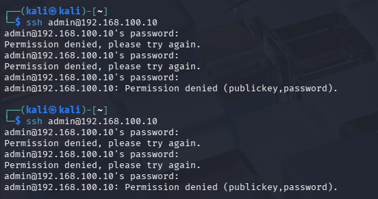
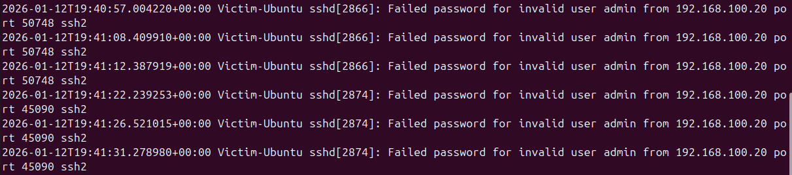
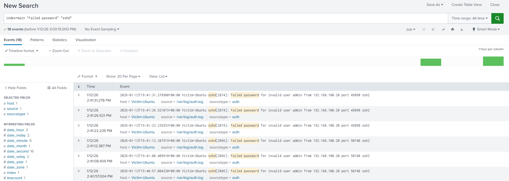
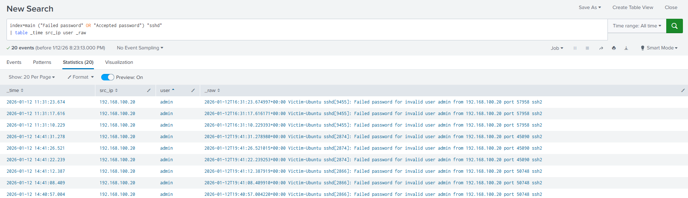
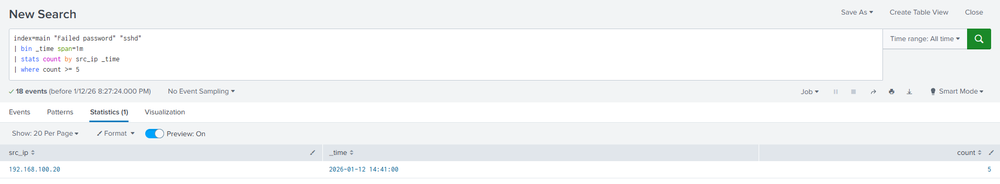

# Scenario 1: SSH Brute Force Attack Detection

## Overview
This scenario demonstrates the detection and investigation of an SSH brute force attack using authentication logs collected from a Linux host and analyzed in Splunk.

The objective is to show a realistic SOC workflow:
1. Manual investigation of authentication events
2. Field extraction and pattern analysis
3. Design of a detection rule suitable for alerting

---

## Lab Environment
- **Attacker VM:** Kali Linux
- **Victim VM:** Ubuntu Server
- **Service:** OpenSSH (sshd)
- **Log Source:** `/var/log/auth.log`
- **SIEM:** Splunk
- **Index:** `main`

---

## Attack Simulation
Multiple SSH login attempts were performed from the attacker VM against the victim Ubuntu server using invalid credentials.

Characteristics of the attack:
- Repeated login attempts in a short time window
- Targeted account: `admin`
- No successful authentication

---

## Investigation Phase

### Purpose
The purpose of this phase is to gain visibility into SSH authentication activity by identifying:
- Source IP addresses
- Targeted usernames
- Failed vs successful login attempts

This step mirrors the initial triage and investigation process performed by a SOC analyst.

### Investigation Query
```spl
index=main ("Failed password" OR "Accepted password") "sshd"
| rex field=_raw "from (?<src_ip>\d+\.\d+\.\d+\.\d+)"
| rex field=_raw "(Failed|Accepted) password for (invalid user )?(?<user>\S+)"
| table _time src_ip user _raw
```

## Outcome
- Confirmed multiple failed SSH login attempts
- Identified a single source IP repeatedly attempting authentication
- No successful logins observed
- Validated brute force behavior before building detection logic

---

## Detection Phase
### Purpose
Based on the investigation findings, a detection rule was created to automatically identify SSH brute force attempts by triggering when multiple failed login attempts originate from the same source IP within a short time window.

### Detection Query
```spl
index=main "Failed password" "sshd"
| rex field=_raw "from (?<src_ip>\d+\.\d+\.\d+\.\d+)"
| bin _time span=1m
| stats count as failed_attempts by src_ip _time
| where failed_attempts >= 5
```

### Detection Logic
- Time window: 1 minute
- Threshold: 5 or more failed login attempts
- Grouped by: Source IP address

---
## Findings
- Total failed attempts: 9
- Source IP: Single attacker IP
- Target account: admin
- Successful logins: None

The activity matches the expected behavior of an SSH brute force attack.

---
## Response & Mitigation
- Block the attacking IP at the firewall or host level
- Continue monitoring for repeated SSH authentication failures

## Notes
- Quotation marks (" ") were required in Splunk searches to correctly match exact log messages (not ' ').
- Field extraction was performed using `rex` to enable structured analysis when default fields were not available.


## Screenshots
Screenshots of Splunk search results and detection output can be found in the `screenshots/` directory.

### Attack Simulation


### SSH Authentication Logs


### Splunk Raw Events


### Investigation Results


### Detection Logic



