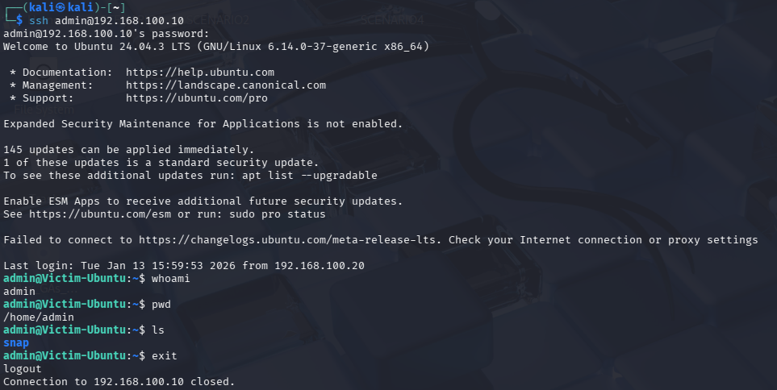
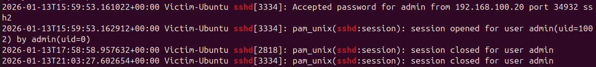
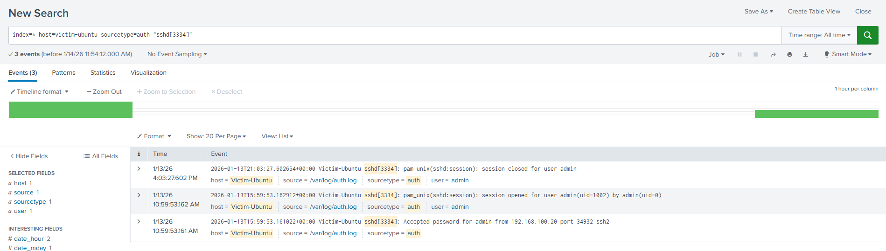

# Scenario 2: Successful SSH Login Scenario

## Scenario Overview
An attacker successfully authenticated to the victim VM via SSH outside normal working hours.  
The attacker accessed the system as `admin` and maintained a session for approximately six hours according to the logs.

---

## Session Details
- **Victim VM Host:** victim-ubuntu
- **Session PID:** 3334
- **Events observed:**
  - `Accepted password` → session opened
  - `session opened`
  - `session closed`

> The session lifecycle confirms a single off-hours SSH session, and PID 3334 is used to track this session across the system and Splunk.

---

## Time Zone Considerations
- The victim VM is configured with **UTC** (`Etc/UTC`), and all system logs reflect this time.
- Splunk displays events according to the portal’s **local timezone** (for example, EST), which may make the timestamps appear different from the VM logs.
- Despite the apparent differences, the **order of events and PID consistency confirm the same SSH session**.

---

## Analysis
- The session occurred **outside of normal work hours**.
- The attacker maintained the session for **an extended period**, increasing potential risk of post-compromise activity.
- **PID-based correlation** between VM logs and Splunk confirms the accuracy of event tracking.
- This scenario demonstrates off-hours access, session tracking, and the importance of understanding time zone differences in log analysis.

---

## Takeaways
- Always correlate **PID and session lifecycle** between system logs and SIEM data.
- Understand that **time zone differences** may cause the same event to appear at different times in the system vs Splunk.
- Prolonged off-hours sessions are a **high-fidelity indicator of suspicious activity** in SOC analysis.

---

## Screenshots

### Successful ssh login

### Victim-ssh session lifecycle observed

### Splunk Analysis

