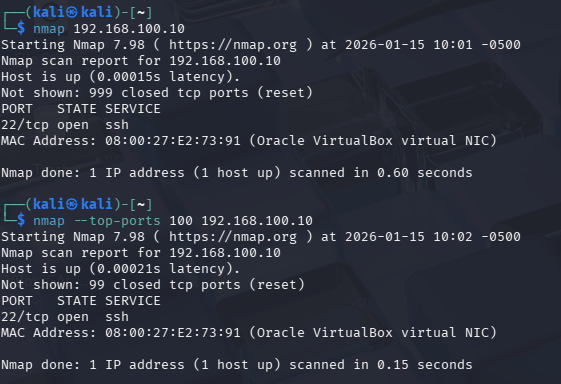
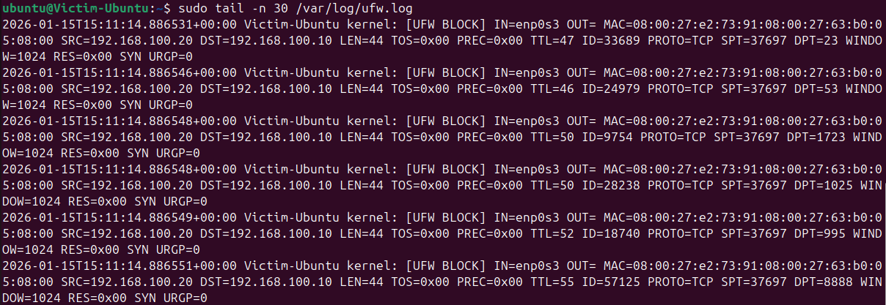
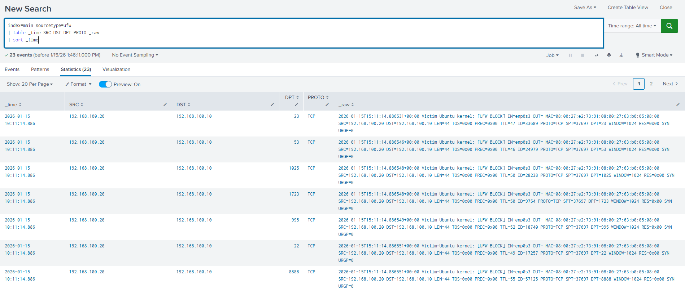
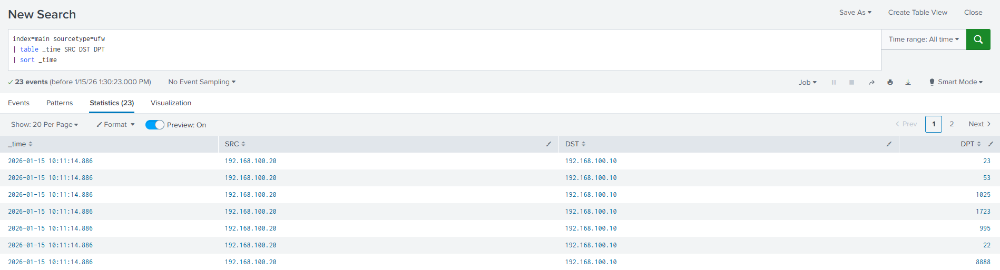
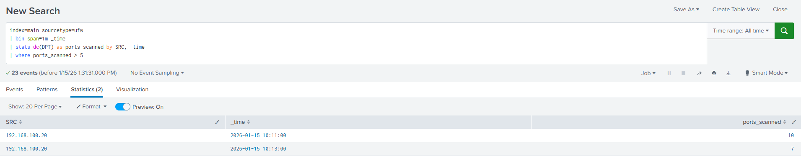

# Scenario 5: Port Scanning Detection

## Overview
This scenario demonstrates the detection and investigation of port scanning activity on Linux host using UFW firewall logs. The attacker VM simulated multiple port scans against the victim VM to generate firewall events.

The objective is to show a realistic SOC workflow:
1. Ingestion of firewall logs into Splunk (manual forwarder update)
2. Identification of port scanning patterns through field inspection
3. Design of a detection query suitable for alerting

   
Note: UFW logs were not automatically ingested, so the Splunk Universal Forwarder was manually configured to monitor `/var/log/ufw.log` and index logs under `main`.

---

## Lab Environment
- **Attacker VM:** Kali Linux
- **Victim VM:** Ubuntu Server
- **Service:** UFW Firewall
- **Log Source:** `/var/log/ufw.log`
- **SIEM:** Splunk
- **Index:** `main`

---

## Attack Simulation
The attacker VM ran Nmap scans against the victim VM to probe multiple TCP ports. The scans were designed to generate UFW BLOCK events.


Characteristics of the attack:
- Multiple ports accessed within a short time frame
- Targeted account: all listening services on victim VM
- All activity was logged in `/var/log/ufw.log`
- Logs were manually ingested into Splunk after updating `inputs.conf`
  
---

## Investigation Phase

### Purpose
The purpose of this phase is to identify port scanning activity by analyzing firewall logs:
- Which source IPs accessed multiple ports
- Which destination ports were targeted
- Event timing and frequency
  

This mirrors a SOC analyst’s workflow in identifying reconnaissance activity.


### Investigation Query
```spl
index=main sourcetype=ufw
| table _time SRC DST DPT PROTO ACTION _raw
| sort _time
```

### Explanation
- Displays raw UFW events including source, destination, and port information
- Confirms that logs were correctly ingested into Splunk
- `_raw` field provides full context of blocked connections

## Outcome
- Confirmed multiple port scanning events from a single source IP
- Captured all relevant fields: SRC, DST, DPT, PROTO, ACTION
- Verified logs are searchable after manual forwarder configuration
  
---

## Detection Phase
### Purpose
Based on the investigation findings, a detection query was created to reliably identify potential port scanning activity.

### Detection Query
```spl
index=main sourcetype=ufw
| bin span=1m _time
| stats dc(DPT) as ports_scanned by SRC, _time
| where ports_scanned > 5
```

### Detection Logic
- Groups events by 1-minute intervals using `bin`
- Counts distinct destination ports per source IP (dc(DPT))
- Flags source IPs scanning more than 5 ports per minute
- Aggregates by SRC and _time to provide clear SOC visibility

---

## Findings
- Detected port scanning activity from 1 attacker IP
- Number of distinct ports accessed in 1 minute : 5-10
- Target host affected: Single Ubuntu server

The activity aligns with expected reconnaissance patterns for network scanning.

---

## Response & Mitigation
- Monitor blocked IPs and alert on repeated port scanning attempts
- Consider firewall rules to mitigate scanning
- Correlate with other suspicious network activity

## Notes
- The `SRC` field represents the source IP initiating the connections
- Logs were manually ingested into Splunk because UFW logs do not forward automatically by default
- Detection query focuses on distinct ports (dc(DPT)) to reduce false positives from repeated attempts to the same port


## Screenshots
Screenshots of full search results and detection output can be found in the `screenshots/` directory.

### Attack Simulation - Port Scan


### Victim UFW Raw Logs


### Splunk - Raw Event 


### Splunk - Field Extraction Table


### Splunk - Detection Results - Stats View

