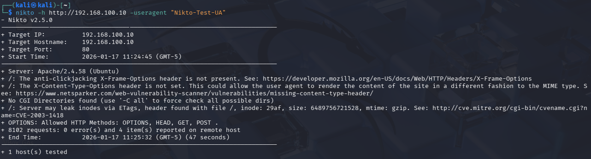
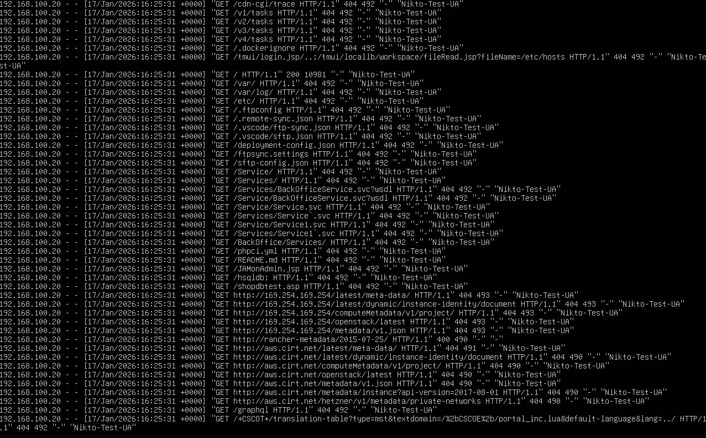
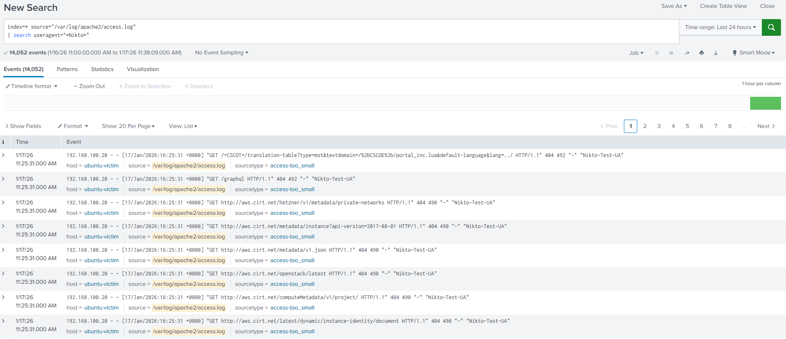
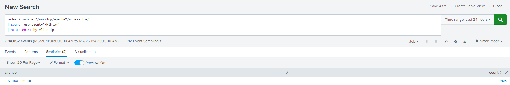
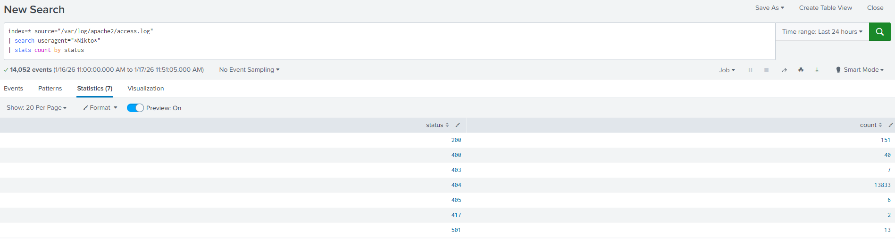

# Scenario 6: Automated Web Reconnaissance Detection (Nikto)

## Overview
This scenario demonstrates the detection and investigation of automated web reconnaissance activity against a Linux-based Apache web server.
An attacker used the Nikto web vulnerability scanner to enumerate potential misconfigurations and exposed paths.
The activity was identified through abnormal HTTP request patterns and analyzed using Splunk.
This scenario focuses on behavior-based detection rather than exploitation.

---

## Lab Environment
- **Attacker VM:** Kali Linux
- **Victim VM:** Ubuntu Server (Apache)
- **Log Source:** Apache access logs (forwarded via Splunk Universal Forwarder)
- **SIEM:** Splunk

---

## Attack Simulation
From the attacker machine, an automated Nikto scan was executed against the victim web server.

The scan generated:
- A large number of HTTP requests in a short time window
- Requests to uncommon and non-existent paths
- An abnormal User-Agent string associated with Nikto

This activity represents a common reconnaissance phase prior to exploitation.
  
---

## Detection & Log Analysis

### Victim-side Log Observation
Apache access logs on the victim server recorded multiple incoming requests from a single external IP.
The requests targeted various URIs and produced a wide range of HTTP status codes, indicating automated scanning rather than normal user behavior.

### Splunk Raw Log Review

Raw Apache access logs were ingested into Splunk and reviewed to confirm:
- Repeated requests from the same client IP
- Presence of a non-browser User-Agent (Nikto-Test-UA)
- High request volume inconsistent with legitimate browsing activity

### Source IP Analysis

Using Splunk statistics, requests were aggregated by client IP.
- A single IP address accounted for the majority of requests
- This IP was confirmed to belong to the attacker (Kali VM)

This strongly indicated centralized automated activity rather than distributed legitimate traffic.

### HTTP Status Code Analysis

Requests were grouped by HTTP status code to understand server responses.

Observed status codes included:
- 200 : Successful requests
- 403 : Forbidden access attempts
- 404 : Non-existent resources
- 405,417,501 : Invalid or unsupported HTTP methods and headers

The diversity of status codes aligns with automated reconnaissance behavior commonly produced by tools like Nikto.
  
---

## Findings

The investigation confirmed:
- Automated web scanning behavior originating from a single source IP
- Use of a known scanning User-Agent
- High-volume, short-interval HTTP requests
- Multiple failed and abnormal access attempts across different endpoints

No exploitation was observed, but the activity represents a **clear reconnaissance-stage attack.**

---

## Conclusion

This scenario demonstrates how a SOC analyst can detect automated web reconnaissance by analyzing web server logs rather than relying on exploit signatures.

Key takeaways:
- Reconnaissance tools are noisy and highly detectable
- Log aggregation and simple statistical analysis are sufficient for detection
- Early identification of scanning activity enables proactive defense before exploitation occurs

Notes: 
- During the investigation, several fields (such as useragent, client_ip, and status) were not automatically extracted.
- To enable effective analysis, the required fields were manually extracted within Splunk.
This allowed accurate aggregation and statistical analysis of request volume, source IP behavior, and HTTP response patterns.

---

## Screenshots

### Attack Simulation - Nikto

### Victim Log Evidence

### Splunk - Raw Event 

### Splunk - clientIP

### Splunk - HTTP status code

