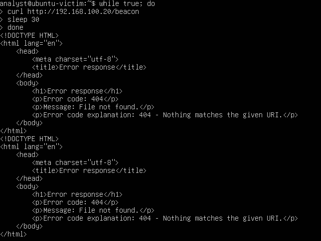
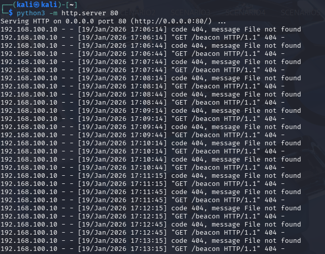
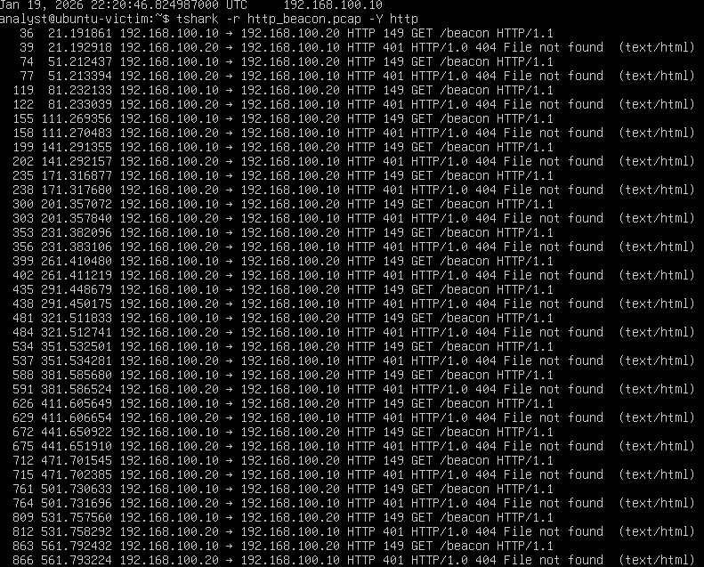
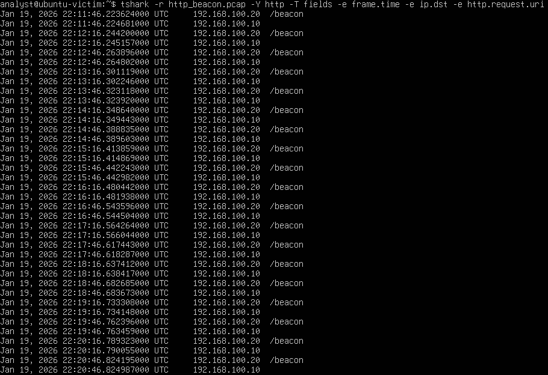

# Scenario 7: HTTP Reverse C2 Beaconing Detection

## Overview
This scenario demonstrates the detection and analysis of **HTTP-based reverse Command and Control (C2) beaconing** activity.
The victim host is assumed to be already compromised, with a malicious process periodically initiating outbound HTTP requests to an external C2 server.
The primary focus of this scenario is identifying **automated, periodic network communication patterns** indicative of C2 beaconing using packet-level analysis.

---

## Lab Environment
**Victim VM**
- OS : Ubuntu Server (CLI-only)
- Role : Compromised host
- Tools : `curl` & `tshark`

**Attacker / C2 server**
- Role : Command and Control server
- Service : HTTP service listening on TCP port 80
  
---

## Attack Simulation
In this scenario, the malicious behavior is simulated to represent a malware process running on the victim host.


The malware logic:
- Initiates outbound HTTP requests to the C2 server
- Repeats the request at a fixed interval (30 seconds)
- Does not require interactive user input

### Simulated Beacon Command
```
while true; do
  curl http://<C2_IP>/beacon
  sleep 30
done
```
This command represents an automated beaconing loop commonly used by malware to check in with a C2 server.

---

## Network Traffic Capture
Due to the absence of a graphical interface on the victim host, network traffic was captured using `tshark`.

### Packet Capture
```
sudo tshark -i enp0s3 -w beacon_capture.pcap
```
The capture was allowed to run for several minutes to observe repeated beaconing behavior before being stopped manually.

---

## Analysis
### HTTP Beaconing Evidence
Captured traffic revealed repeated outbound HTTP requests with the following characteristics:

- HTTP Method : `GET`
- URI : /beacon
- Destination IP : Fixed external C2 server
- Destination Port : 80
- Direction : Outbound only (Victim -> C2)

Example filtered output:
```
sudo tshark -r beacon_capture.pcap -Y "http.request"
```

---

## Beaconing Interval Analysis
The HTTP requests occured at **consistent 30-second intervals**, strongly indicating automated behavior rather than user-driven activity.

Key indicators:
- Regular timing
- Identical request structure
- No variation in destination or URI

This timing-based pattern is a common evidence of C2 beaconing activity.

---

## Key Findings

- The victim host initiated repeated outbound HTTP connections to a fixed external server.
- Traffic patterns showed consistent periodicity, indicating automation.
- No inbound connections from the attacker were observed.
- The behavior aligns with **HTTP reverse C2 beaconing**, where the compromised host checks in with the attacker-controlled server.

---

## Conclusion

This scenario demonstrates how HTTP-based reverse C2 beaconing can be identified through packet-level network analysis alone.
Even without SIEM or host-based telemetry, consistent outbound communication patterns and timing analysis provide strong indicators of command-and-control activity.

## Detection takeaways:
- Fixed destination + fixed interval = high-confidence beaconing signal
- Outbound-only traffic often bypasses firewall restrictions
- Packet capture analysis remains effective even in limited telemetry enviornments

---

## Screenshots

### Beaconing Execution


### C2 server request evidence - Attacker


### tshark - HTTP GET beacon


### tshark - Interval beacon

